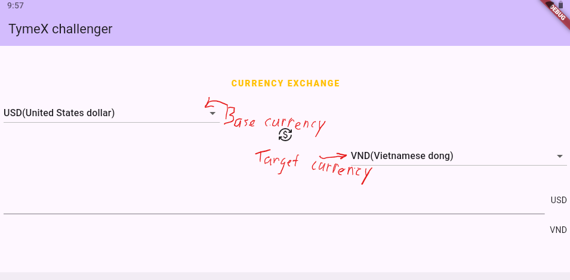
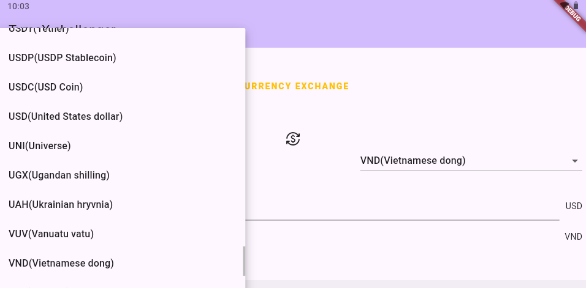
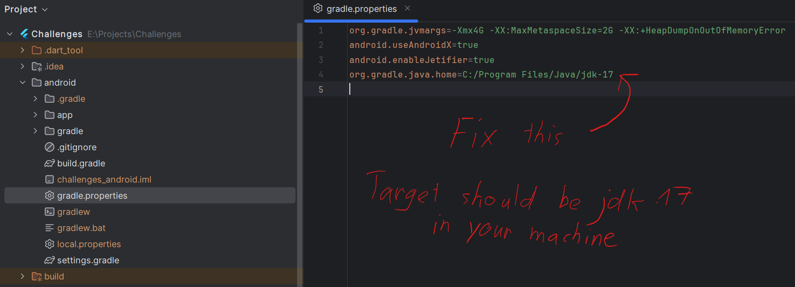

# challenges

## Overview

App is built with Flutter.

## Build and run

1. Install Flutter

- [Follow instruction and install Flutter](https://docs.flutter.dev/get-started/install)

2. Open project

- Download and unzip this project.

- Open project in your IDE.

3. Build and run

- Choose option(s) depending on your needs:
  - [Android](https://docs.flutter.dev/deployment/android)
  - [iOS](https://docs.flutter.dev/deployment/ios)

**Support you may need**
- Links:
  - [How to build and distribute iOS apps without Mac with Flutter & Codemagic](https://blog.codemagic.io/how-to-build-and-distribute-ios-apps-without-mac-with-flutter-codemagic/)
- Videos:
  - [How to build iOS app without a MacBook - Flutter tutorial](https://www.youtube.com/watch?v=NRuW223LY58)
  - [[CLI] How to build & publish a Flutter iOS app with windows](https://www.youtube.com/watch?v=D9NYNmXFphE)

## Known issues
- JDK mismatch

  - This fix is for Android build only.
  - Find file in project structure: **android/gradle.properties**
  - Change the directory of org.gradle.java.home (the last row) in file **gradle.properties**

- Illegitimate currencies
  - There are flaws in used dependency *currency_converter*. There are currencies with wrong name, outdated currencies and also those with mismatch data(I think) which cannot be used as well as return no error when being selected.
